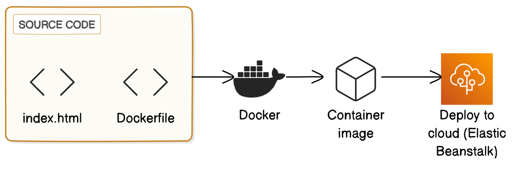

# AWS Elastic Beanstalk Docker Deployment

## Project Overview

This project demonstrates deploying a web application on AWS using Elastic Beanstalk with Docker. The application includes a simple `index.html` file that is containerized using Docker and deployed to the cloud using Elastic Beanstalk. This setup allows the application to scale automatically based on demand, leveraging the flexibility of cloud-native services.

## Project Architecture



### Architecture Overview
1. **Source Code**: Contains `index.html` and a `Dockerfile` to create the Docker image.
2. **Docker**: Docker is used to build the application into a container image.
3. **Container Image**: The Docker image is built and configured, ready for deployment.
4. **AWS Elastic Beanstalk**: The containerized application is deployed to AWS Elastic Beanstalk, which manages resources, scaling, and monitoring.

## Technologies Used

- **Docker**: For containerizing the application.
- **AWS Elastic Beanstalk**: For deploying and managing the application in the cloud.
- **HTML**: Simple static page hosted within the container.

## Features

- **Containerized Application**: The project uses Docker to package the application.
- **Cloud Deployment**: Application is deployed and managed in AWS Elastic Beanstalk.
- **Scalability**: Elastic Beanstalk scales the application based on traffic, automatically managing load balancing and scaling.

## Setup and Deployment Instructions

### Prerequisites

- **AWS CLI**: Install and configure the AWS CLI with appropriate permissions.
- **Docker**: Install Docker to build and test the container image locally.

### Steps

1. **Clone the Repository**:
   ```bash
   git clone https://github.com/swetharanga/aws-elastic-beanstalk-docker.git
